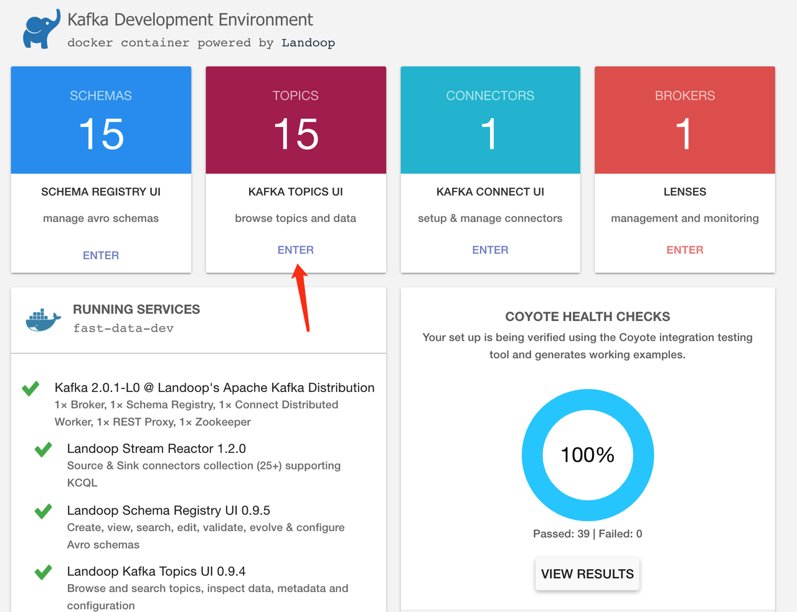
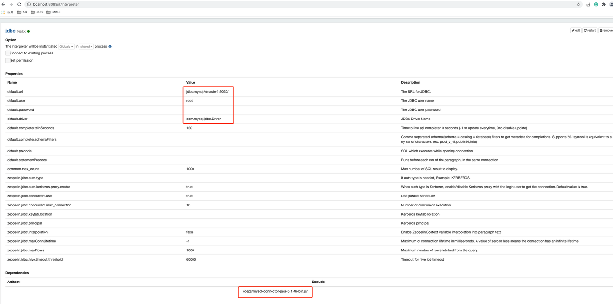
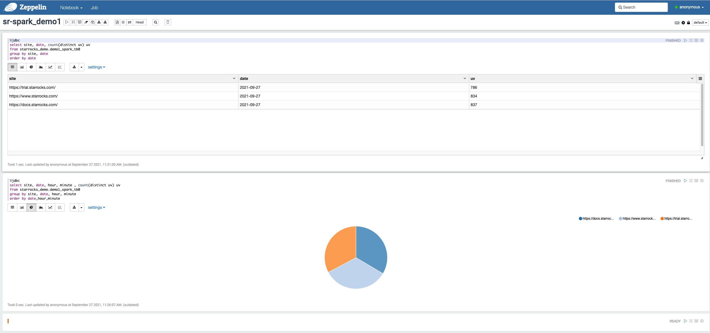

# 01_sparkStreaming2StarRocks

## Demonstration Description

Streaming computing the UV metric for each time period on a realtime Dashboard. 

### DataFlow

> mimic -> Kafka -> spark streaming -> stream load -> StarRocks -> zeppline UI (chart)

## Preparations

### 1. Kafka

Pull a docker-landoop as local testing environment ( Deploy your own Kafka cluster works as well. ) .

```
### Get docker-landoop：
docker pull landoop/fast-data-dev

### Start landoop
docker run --rm -d -p 2181:2181 -p 3030:3030 -p 7081-7083:8081-8083  -p 9581-9585:9581-9585 -p 9092:9092 -e ADV_HOST="${myip:=127.0.0.1}"  landoop/fast-data-dev:latest

### Open landoop web ui in browser as below.
open http://127.0.0.1:3030
```

cTopic.sh creates kafka topic spark_demo1_src
```
# cTopic.sh create spark_demo1_src  
                                                           
Created topic "spark_demo1_src".
```

landoop web ui:



topic is empty by far:


### 2. Mimic the data

- The python script is used to simulate the JSON data.
- Kafka-console-consumer is used to input Kafka periodically.
- The generator code demo1_data_gen.py is wrapped in the gendata.sh script.

## Testing

### 1. Data Generation

Result: Random generation of integers up to 10 every 2s and  send to topic spark_demo1_src.

```
#bash  ../sh/genData.sh 2 10 spark_demo1_src                                                                      Usage: ../sh/genData.sh topicName  interval
Sending time data to spark_demo1_src every 2 seconds...
>>>>>>>>>>>>>>>>>>>>>>>>>>>>>>>>>>>>>>>>>>>>>>>>>>>>>>>>>
```   

landoop observes the data in topic spark_demo1_src


### 2. DDL

```
CREATE TABLE `demo1_spark_tb0` (
    `site`   varchar(50) NULL COMMENT "",
    `date`   DATE     NULL  COMMENT "",
    `hour`   smallint NULL COMMENT "",
    `minute` smallint NULL COMMENT "",
    `uv`  BITMAP BITMAP_UNION
) ENGINE=OLAP
AGGREGATE KEY(`site`,`date`,  `hour` , `minute` )
COMMENT "OLAP"
DISTRIBUTED BY HASH(`site`) BUCKETS 10
PROPERTIES (
    "replication_num" = "1",
    "in_memory" = "false",
    "storage_format" = "DEFAULT"
);
```

### 3. Run the demo 

Compile and run com.starrocks.spark.SparkStreaming2StarRocks in Module SparkDemo


### 4. Verification

Connect to StarRocks via Mysql Client to check the result:

```
MySQL [starrocks_demo]> select * from demo1_spark_tb0 limit 5;
+---------------------------+------------+------+--------+------+
| site                      | date       | hour | minute | uv   |
+---------------------------+------------+------+--------+------+
| https://docs.starrocks.com/ | 2021-05-29 |   14 |     45 | NULL |
| https://docs.starrocks.com/ | 2021-05-29 |   14 |     48 | NULL |
| https://docs.starrocks.com/ | 2021-05-29 |   15 |     18 | NULL |
| https://docs.starrocks.com/ | 2021-05-29 |   15 |     21 | NULL |
| https://docs.starrocks.com/ | 2021-05-29 |   15 |     29 | NULL |
+---------------------------+------------+------+--------+------+
5 rows in set (0.01 sec)

MySQL [starrocks_demo]> select count(distinct uv) uv  from demo1_spark_tb0 ;
+------+
| uv   |
+------+
|  146 |
+------+
1 row in set (0.02 sec)

MySQL [starrocks_demo]> select site, count(distinct uv) uv  from demo1_spark_tb0 group by site;
+----------------------------+------+
| site                       | uv   |
+----------------------------+------+
| https://www.starrocks.com/   |   71 |
| https://trial.starrocks.com/ |   42 |
| https://docs.starrocks.com/  |   63 |
+----------------------------+------+

MySQL [starrocks_demo]> select site,hour, count(distinct uv) uv  from demo1_spark_tb0 group by site,hour;
+----------------------------+------+------+
| site                       | hour | uv   |
+----------------------------+------+------+
| https://www.starrocks.com/   |   14 |    8 |
| https://www.starrocks.com/   |   15 |  150 |
| https://www.starrocks.com/   |   16 |  258 |
| https://trial.starrocks.com/ |   14 |    6 |
| https://trial.starrocks.com/ |   15 |  133 |
| https://docs.starrocks.com/  |   14 |    4 |
| https://docs.starrocks.com/  |   15 |  157 |
| https://docs.starrocks.com/  |   16 |  231 |
| https://trial.starrocks.com/ |   16 |  228 |
+----------------------------+------+------+
9 rows in set (0.01 sec)
```

## Data Visualization

### 1. Get zeppelin 

```
docker pull apache/zeppelin

# which myzeppelin
myzeppelin: aliased to docker run -p 8089:8080  -v /Users/simon/Documents/zep:/opt/zeppelin -v /Users/simon/Documents/zep/logs:/logs -v /Users/simon/Documents/zep/notebooks:/notebook   -e ZEPPELIN_LOG_DIR='/logs'  -e ZEPPELIN_NOTEBOOK_DIR='/notebook' -v /etc/localtime:/etc/localtime -v /Users/simon/Documents/zep/deps:/deps --rm  -d --name zeppelin apache/zeppelin:0.9.0; sleep 10; open http://localhost:8089
```

### 2. Zeppelin configuration
- jdbc configures


  
- new a notebook


  
### 3. visualization effect

- Time series histogram

> On realtime Dashboard, bar-chart increases when live data refresh


- Pie Chart

> The proportion of visits to each site




# License

StarRocks/demo is under the Apache 2.0 license. See the [LICENSE](../LICENSE) file for details.
